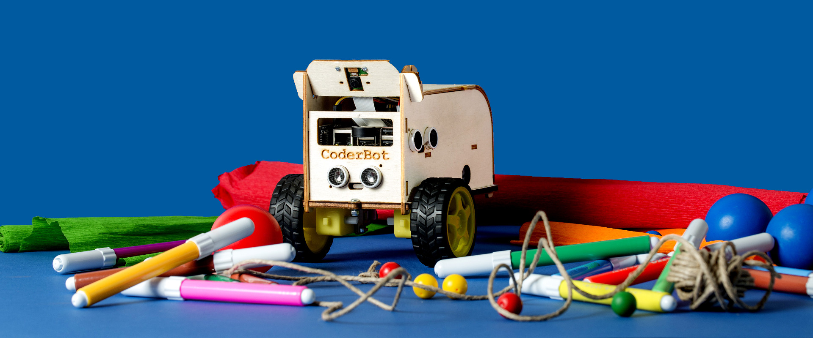
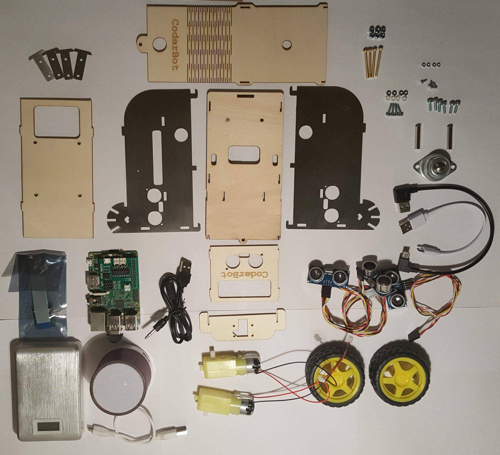
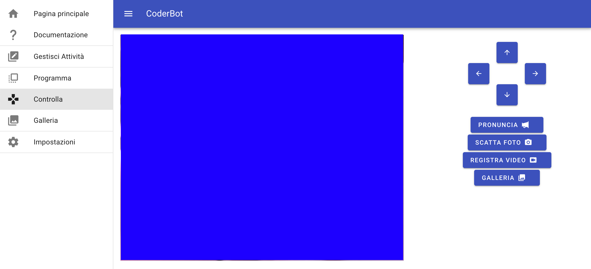
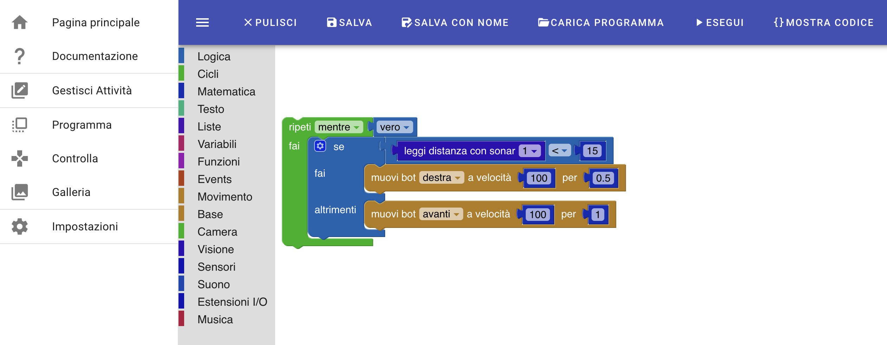
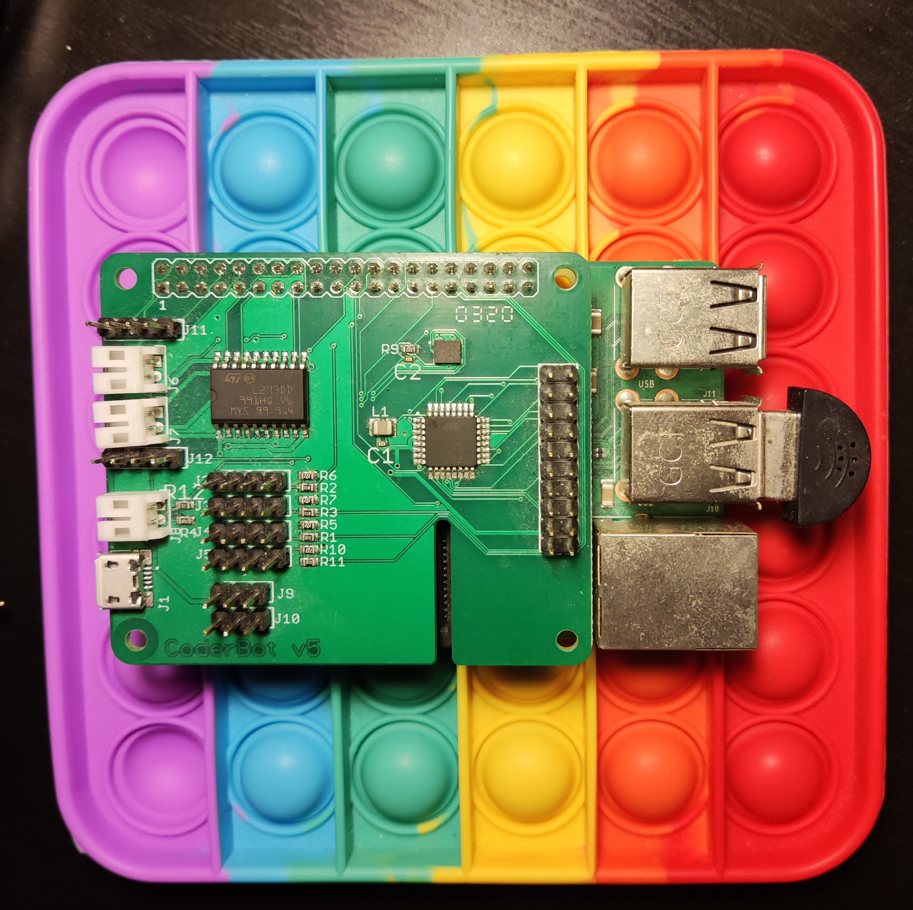

# Description

CoderBot is an educational robot for the age of 5 - 99.

CoderBot is phisically a "rover" which can move on a plain surface by using the two morized wheels and a free ball caster. 

CoderBot can be remotely controlled and programmed to move and interact with the environment by using sensors.

The main use case for CoderBot is to enable didactical experiences based on computer programming, using a simple and visual language based on blocks.

The blocks editor allows the people interacting with CoderBot to write programs with a visual, interactive drag & drop interface available in a web browser on a client computer connected to CoderBot.
The program is executed directly by the CoderBot on board computer, so that CoderBot is independent from the client machine.

The hardware is mostly based on the Raspberry Pi and a "hat" which hosts motor control logic, ultrasonc sensor interface, an accelerometer/gyroscope/compass, and an atmega328 for I/O expansion.

See [Hardware Architecture](Hardware_Architecture.md) for a detailed description of all hardware components.

The CoderBot Software is based on the Linux operating system. 

The software is normally run as a set of docker images on top of the [BalenaOS](https://balenaos.io/) OS.

See [Software Architecture](Software_Architecture.md) for a detailed description of all software components. 