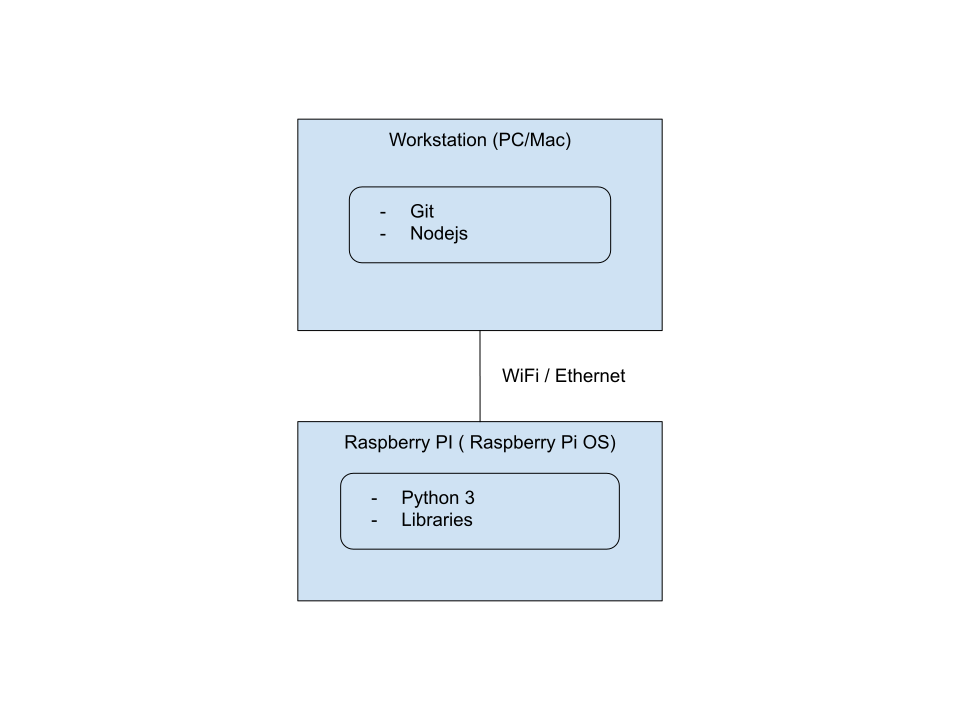
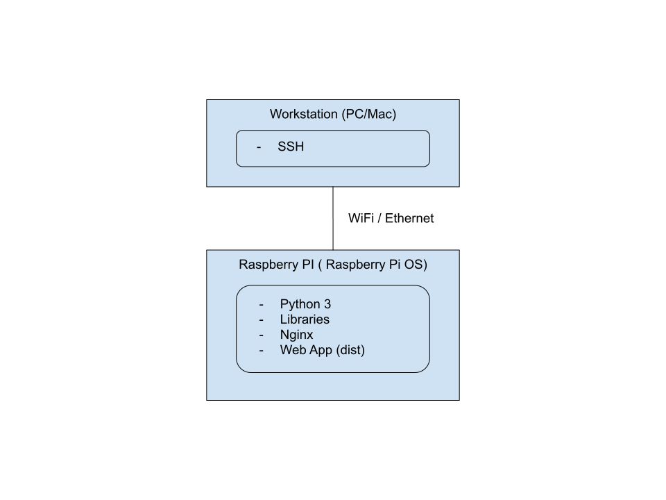
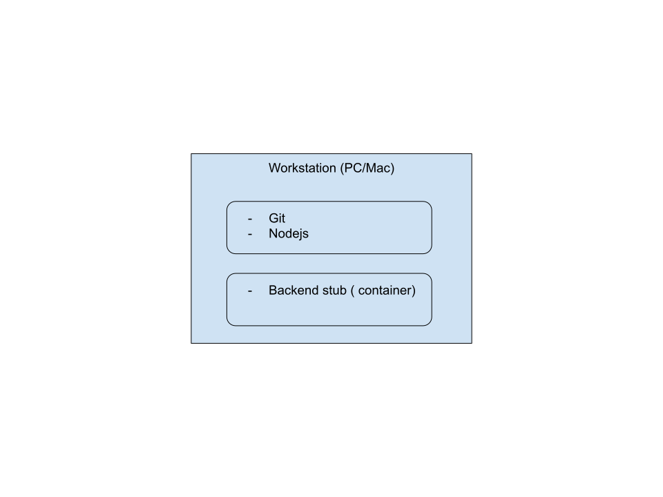

# Getting started

CoderBot, when in "production" runs in containers hosted on the BalenaOS. To prepare a production runtime, see [Deployment](./Deployment.md) guide.

The following guide is about preparing an environment suitable for development of frontend (WebApp) and backend CoderBot components.

## Choose your development environment

Although a complete environment will be composed of a workstation running nodejs and an IDE and a Raspberry Pi running the Raspberry OS (Linux Debian), it is possible to use a "stub" running in a container on the workstation in order to avoid the requirement of the Raspberry Pi while developing just the frontend. 

These are the possible choices of development environment.

### Web App on workstation, backend on Raspberry Pi



The most complete and preferred development environment, it enables development of both components: frontend on the workstation (PC or Mac) and backend directly on the Raspberry PI.

### Web App on Raspberry Pi, backend on Raspberry Pi



This environment is the best option when you only need to develop on the Web App (frontend), while the backend runs on a "real" Raspberry Pi, so fully exposing CoderBot backend APIs.

### Web App on workstation, backend on local docker (stub)



This environment is a valid alternative for developing the Web App and the CoderBot APIs mocked by the backend "stub" are enough for enabling frontend development.

The backend "stub" implements most APIs but mocks most phisycal input and output, such as sensor reading and motor control. Also the camera input is a fixed jpeg image, and cannot be used to test computer vision functions, as well as neural netowrks.

## Installation

### Workstation, Web App

1. Install [Nodejs](https://nodejs.org/en/) either by installing directly on the workstation or running a docker image (in that case, [install docker](https://docs.docker.com/get-docker/)).
1. Install [Git](https://git-scm.com/)
1. Clone frontend repo locally: `git clone https://github.com/CoderBotOrg/frontend.git`
1. Install packages, run local server: `cd frontend && npm i && npm run dev`

### Workstation, backend stub

1. Install [docker](https://docs.docker.com/get-docker/)
1. Run backend stub: `docker run -dp 8090:5000 ghcr.io/coderbotorg/backend:stub-latest`

### Raspberry Pi, backend, frontend (dist package)

1. flash a micro-sd card (at least 8GB RAM, possibly class 10) with the latest release of the Raspberry OS (32bit), using the [Raspberry-provided desktop app](https://www.raspberrypi.com/software/). Do not forget to enable ssh and the WiFi connection configuration.
1. login via ssh to the Raspberry Pi, [download the script to install requirements](https://github.com/CoderBotOrg/system-install/archive/refs/heads/master.zip)
1. run the `install_dev.sh` script in the `system-install` directory.

After the script has been executed, a directory named `coderbot` should be present in the `/home/pi` path.

Run the backend `cd coderbot && ./start.sh`

You should see on the console the output log of the backend starting. 

The backend is properly started and ready to accept connection from the client when the following line is printed in the log:

```
[...]
INFO:root:starting camera
INFO:root:camera init
INFO:cnn.cnn_classifier:./cnn_models/generic_fast_low.tflite
INFO:root:loaded: generic_fast_low <cnn.cnn_classifier.CNNClassifier object at 0x681b4340>
 * Serving Flask app 'main'
 * Debug mode: off
INFO:werkzeug:WARNING: This is a development server. Do not use it in a production deployment. Use a production WSGI server instead.
 * Running on all addresses (0.0.0.0)
 * Running on http://127.0.0.1:5000
 * Running on http://192.168.1.16:5000
INFO:werkzeug:Press CTRL+C to quit
```

## Make your first change

To see if everything is correctly configured, try to make a small change to the frontend and / or the backend

1. Open a browser and load the main (landing) page `http://localhost:8080`
2. See the message "Welcome to CoderBot"
3. On the frontend (if the dev server is running on the local workstation), modify the file `frontend/src/components/Landing.vue` at line 12, Change

```
        <div class="logo">CoderBot</div>
```
to:
```
        <div class="logo">my first change to CoderBot</div>
```
4. You should see the landing page has been changed and the message is now "Welcome to my first change to CoderBot"