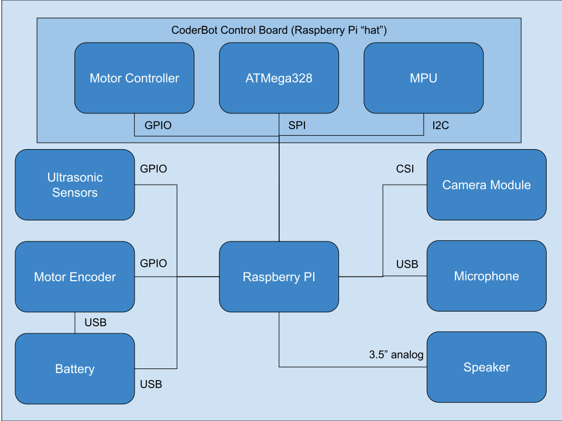

# Hardware Architecture

CoderBot is based on Raspberry Pi computer, equipped with a contorl board "hat".

The Raspberry is powered by a lithium-ion powerbank and is connected to an USB microphone, a speaker via the 3.5" audio jack and to the camera module via the CSI port.

## Raspberry Pi

CoderBot has been tested with the following Raspberry Pi models:
- Model B 3
- Model B+ 3
- Model A+ 3

No tests has been done with Model B 4, Compute Module 4 and Zero W 2, although they should be compatible with the software.

## Micro-SD card

The micro-sd card must have at least 8GB capacity. Class 10 cards are recommended.

## Camera module

The camera used is the [standard Raspberry Pi camera module](https://www.raspberrypi.com/documentation/accessories/camera.html) "v1" (5 megapixel). The "v2" camera can also be used, as well as special infrared versions.

## Control board

The control board contains logic to accomplish the following:
- control motors (DC, PWM)
- control two servos (PWM)
- read encoder data from motors
- control and read ultrasonic sensors
- read MPU (accelerometer/gyroscope/compass) data
- read/write data to the on board atmega328 

## Microphone

The microphone can be any device with an USB connection.

## Speaker

The speaker is connected to the 3.5" headphones output, it must be an amplified speaker with > 1 Watt.

## Battery

The battery used is a powerbank with a nominal capacity of 10000mAh and two separate USB outputs, each with 2A nominal output current.

The battery must have separate outputs and a rather large capacity to sustain the peak consumption caused by starting the motors and at the same time supply 5V, 1A to the Raspberry Pi, without any interruptions.
