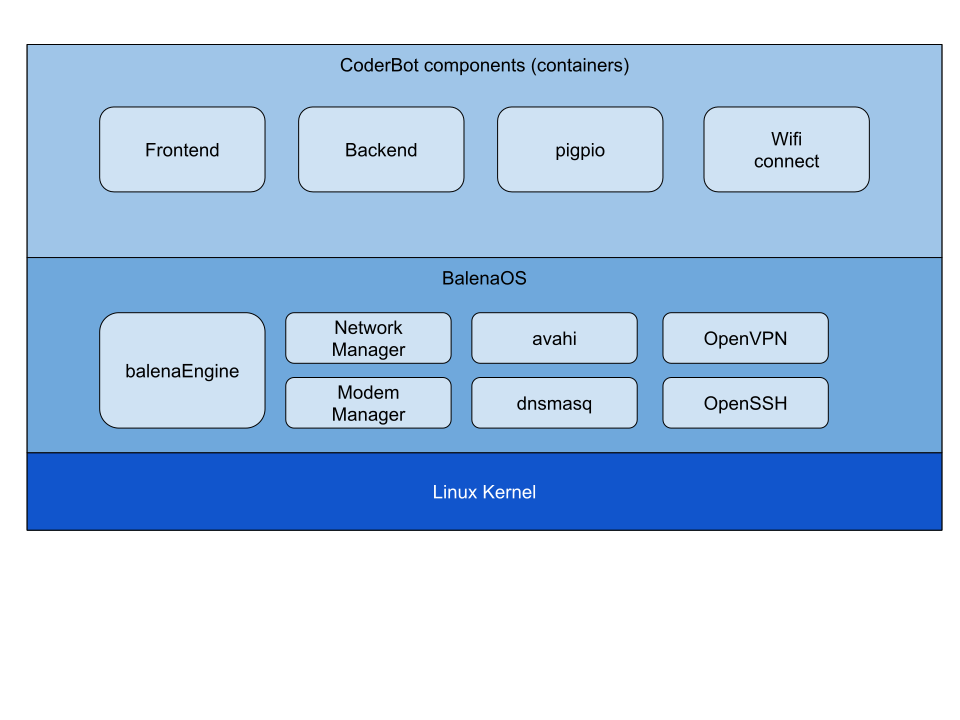
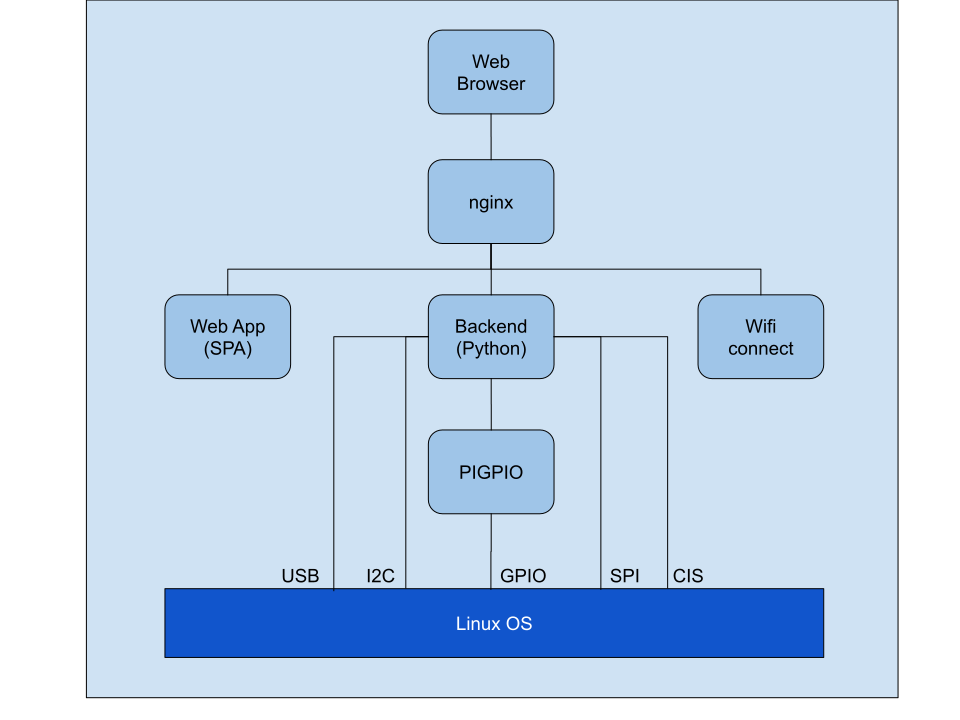

# Software Architecture

CoderBot is composed of several modules which run on top of a Linux operating system.

All componens are deployed as containers orchestrated by the [Balena Engine](https://balena.io/), an optimized version of the Moby project.

The CoderBot UI is a Single Page Web Application which runs in any web browser and communicates with the backend via REST APIs over HTTP.

The backend implements all control logic and image processing. The input and output with the phisical devices is either direct (for USB, I2C and SPI interfaces) and meadiated by PIGPIO component, which runs on a separate container and communicates with the backend via TCP sockets.

## Frontend

The **frontend** is an nginx web server which acts both as a web server and as a reverse proxy.

The web server exposes the CoderBot UI Web Application, which is implemented by a Single Page Application which is served by the CoderBot itself.

The reverse proxy expose both the **backend** and the **wifi-connect** REST APIs.

## Backend

The **backend** is a Python application, built with Flask and Connexion frameworks, which implements all the CoderBot control logic as well as the user defined program execution.

## PIGPIO

The **pigpio** component is a linux daemon used to interface the backend to the GPIO hardware. 

The main features of this component are the ability to perform high frequency polling on the GPIO states, emulating hardware interruptt, and to control the outputs via software implemented Pulse Width Modulation (PWM).

The backend communicates with pigpio daemon via socket interface.

## Wifi-Connect

This component handles the configuration of the Raspberry PI WiFi interface.

The module exposes a simple REST API and interacts with the WiFi adapter via NetworkManager system service.